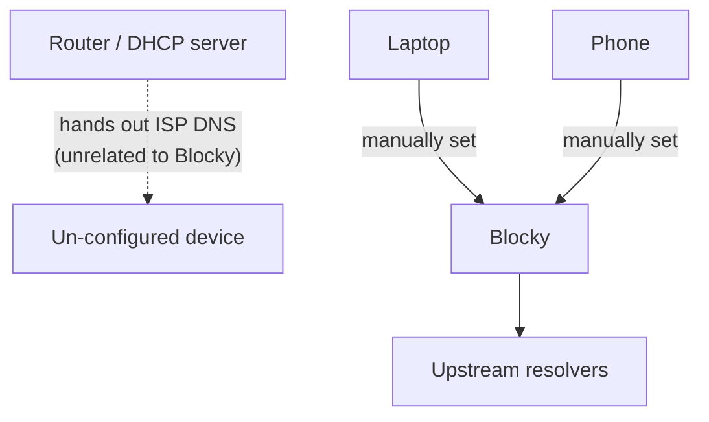
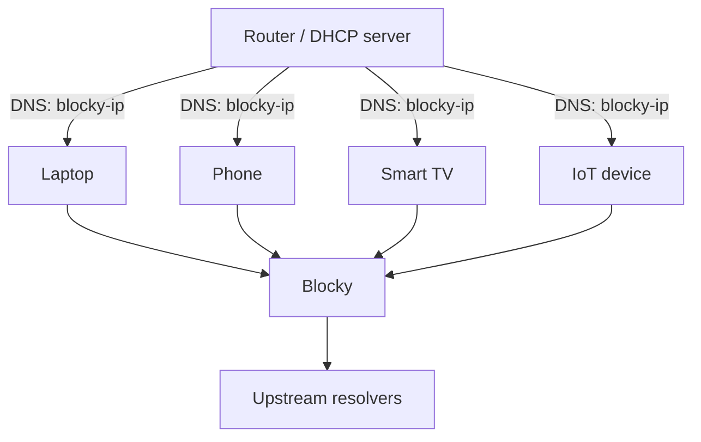

# Network Setup

Blocky only does anything useful if devices actually send it their DNS queries. This page covers how that's currently arranged, and how it's expected to change.

:::info Current state: per-device, not router-wide
Right now, each device is individually configured to use Blocky as its DNS server. **The router does not yet hand out Blocky via DHCP** — that's a planned change (see [Planned: router-level DHCP](#planned-router-level-dhcp) below), but until then, a device not manually configured falls back to whatever DNS it gets by default (typically the ISP's), and gets no blocking, no local hostname resolution, and no logging.
:::

## Per-device configuration (current setup)

Each device that should use Blocky has its DNS server set manually, pointing at Blocky's IP:



- **Windows**: Network adapter settings → IPv4 properties → "Use the following DNS server addresses."
- **macOS**: System Settings → Network → (interface) → Details → DNS.
- **iOS**: Settings → Wi-Fi → (network) → Configure DNS → Manual.
- **Android**: Wi-Fi network settings → IP settings → Static (varies by device/version), or Private DNS if using DoT.
- **Linux (NetworkManager)**: `nmcli con mod <connection> ipv4.dns "<blocky-ip>"`.

The trade-off of this approach: it's per-device effort, it's easy to forget on a new device, and most IoT devices don't expose a DNS setting at all — so they're currently *not* covered by Blocky (no blocking, no logging) until the router-level rollout below happens.

## Planned: router-level DHCP

The intended end state is the router's DHCP server handing out Blocky's IP to every device automatically, the way it's typically done:



Once in place:

- No more per-device setup — anything that joins the LAN and takes a DHCP lease is automatically covered, IoT devices included.
- A device can only opt out by manually overriding its DNS settings, which is a meaningfully higher bar than "never configured in the first place."
- Redundancy becomes worth setting up properly — DHCP configured with Blocky as primary and a fallback (e.g. a public resolver) as secondary, so a Blocky outage degrades to slower/unfiltered resolution rather than a full network outage. Most operating systems don't intelligently detect "primary is down" — they retry the primary first and fall through after a timeout — so this is a safety net, not instant failover.

This page will be updated once the switch happens; until then, treat "is this device using Blocky" as something to check per-device (see below) rather than something the network guarantees.

## IPv6 considerations

If a device has IPv6 enabled, it may resolve DNS over IPv6 to its default resolver even after its IPv4 DNS is pointed at Blocky, unless the IPv6 DNS setting is changed too (or IPv6 is disabled on that device/network). Worth checking explicitly per device, and doubly so once router-level DHCP is in place — DHCPv6/RA would also need to advertise Blocky as the resolver, or IPv6-capable devices could silently bypass it entirely.

## Verifying a device is actually using Blocky

```bash
# On the device itself:
nslookup middlefield.xyz
# Look at which server answered — it should be Blocky's IP.
```

Or, more reliably: check the [query log](./monitoring-logging#query-log) for that device's client name/IP after generating some traffic on it. If it never appears, its DNS setting (or a VPN/DoH setting baked into a browser or app — see [Troubleshooting → A device seems to bypass blocking](./troubleshooting#a-device-seems-to-bypass-blocking)) is pointed somewhere else, or it was simply never configured in the first place.
