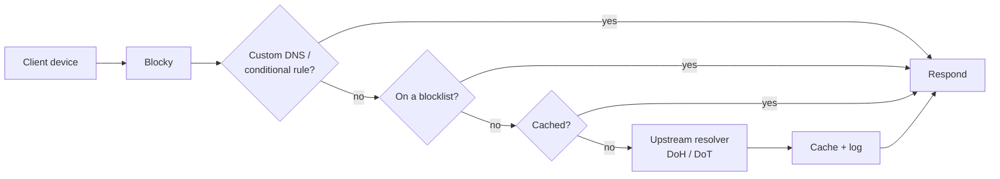

# Overview

Middlefield runs its own recursive DNS resolver on top of **[Blocky](https://0xerr0r.github.io/blocky/)** — a fast, lightweight, DNS proxy and ad/tracker blocker written in Go. Devices are configured to send their DNS queries to it instead of an ISP resolver or a public resolver like `1.1.1.1` or `8.8.8.8`.

:::info
Right now this is set up **per-device** rather than network-wide — see [Network Setup](./network-setup) for what that means and the plan to move it to the router.
:::

This section documents how the resolver is built, configured, and operated — useful if you manage it, and useful as a reference if something on the network stops resolving and you need to know where to look.

## Why self-host DNS

- **Network-wide ad & tracker blocking** — blocking happens at the DNS layer, so it protects every device on the network (phones, TVs, IoT gadgets) without installing anything on each one, and it works even in apps that ignore in-browser blockers.
- **Privacy** — queries aren't sent in bulk to a third-party resolver that may log and monetize them; Blocky forwards upstream over encrypted DNS (DoH/DoT) and can keep query logs local.
- **Local name resolution** — internal-only hostnames (e.g. `truenas.middlefield.internal`) can be resolved without needing public DNS records, and public hostnames can be rewritten to internal IPs to avoid unnecessary round-trips through a reverse proxy over the WAN (DNS "hairpinning"/split-horizon).
- **Control and visibility** — a live query log shows what every device is actually resolving, which is often the fastest way to notice something (or someone) doing things it shouldn't.
- **Speed** — responses are cached locally, so repeat lookups for popular domains are answered in well under a millisecond instead of round-tripping to an upstream resolver.

## What Blocky actually does

At its core, Blocky sits between clients and the wider internet and, for every query, works through a pipeline:

1. **Receive** the query on port 53 (UDP/TCP), or optionally over DNS-over-TLS/HTTPS.
2. **Check custom mappings** — local hostnames, rewrites, and conditional/split-horizon forwarding rules are checked before anything goes upstream.
3. **Check blocklists** — the queried domain is checked against denylists (and allowlists), and if blocked, a `0.0.0.0`/NXDOMAIN-style response is returned immediately.
4. **Check the cache** — if a non-blocked answer for this name/type is already cached and unexpired, it's returned immediately.
5. **Forward upstream** — otherwise the query is sent to one or more configured upstream resolvers (in parallel or with a defined strategy), the response is cached, logged, and returned to the client.

## High-level architecture

| Component | Role |
|---|---|
| **Blocky** | The resolver itself — handles queries, blocking, caching, custom DNS, and its REST API. |
| **blocky-ui** | Web dashboard on top of Blocky's API — live query log, blocking toggle, list refresh, and current config at a glance. See [Monitoring & Logging](./monitoring-logging). |
| **Router (DHCP)** | *Planned* — will hand out Blocky's IP as the DNS server to every device on the LAN. Devices are configured individually for now — see [Network Setup](./network-setup). |

See [Installation](./installation) for how the containers are deployed, [Configuration](./configuration) for the full config reference, and [Network Setup](./network-setup) for how clients actually end up pointed at it.

:::info
Blocky itself doesn't ship a UI — **blocky-ui** is a separate, small container that provides one on top of Blocky's REST API. Day-to-day state (is blocking on, what's being blocked right now, live query log) is checked there rather than via raw `curl` calls — see [Monitoring & Logging](./monitoring-logging).
:::
